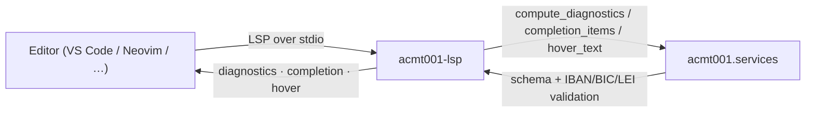

# Acmt001-lsp: A Language Server for Authoring ISO 20022 Account-Data Files

![Acmt001-lsp banner][banner]

[![PyPI Version][pypi-badge]][07]
[![Python Versions][python-versions-badge]][07]
[![PyPI Downloads][pypi-downloads-badge]][07]
[![Licence][licence-badge]][01]
[![Tests][tests-badge]][tests-url]
[![Quality][quality-badge]][quality-url]
[![Documentation][docs-badge]][docs-url]

**Real-time editor help for ISO 20022 account-data files** — diagnostics,
completion, and hover as you author the JSON records that drive `acmt`
message generation.

> **Latest release: v0.0.1** — a [pygls][pygls]-based Language Server with
> schema + IBAN/BIC/LEI diagnostics, field and message-type completion, and
> schema-description hover, all backed by `acmt001.services`.
> [See what's new →][release-001]

## Contents

- [Overview](#overview)
- [Install](#install)
- [Quick Start](#quick-start)
  - [Editor wiring](#editor-wiring)
- [Features](#features)
- [Using the helpers](#using-the-helpers)
- [Examples](#examples)
- [Benchmarks](#benchmarks)
- [Development](#development)
- [Licence](#licence)
- [Contribution](#contribution)
- [Acknowledgements](#acknowledgements)

## Overview

A **Language Server** speaks the
[Language Server Protocol (LSP)][lsp] — the editor-agnostic protocol that lets a
single backend deliver diagnostics, completion, hover, and more to any LSP
client (VS Code, Neovim, Helix, Emacs, …). **Acmt001-lsp** is that backend for
**account-data JSON files**: the JSON arrays of flat account records that drive
ISO 20022 `acmt` message generation in the
[`acmt001`][acmt001] suite.

- **Website:** <https://acmt001.com>
- **Source code:** <https://github.com/sebastienrousseau/acmt001-lsp>
- **Bug reports:** <https://github.com/sebastienrousseau/acmt001-lsp/issues>

It gives editors three features as you type, all backed by
`acmt001.services` so they behave identically to the CLI, REST API, and MCP
server:

- **Diagnostics** — each record is validated against a message type's input
  JSON Schema, and any IBAN / BIC / LEI identifier values are additionally
  checked with the dedicated validators.
- **Completion** — every input field (with its description) plus the list of
  supported `acmt` message types.
- **Hover** — the schema description for the field under the cursor.

The intended message type defaults to `acmt.007.001.05` (Account Opening
Request); the pure helpers accept a `message_type` argument so a different type
can be configured.

**Acmt001-lsp** is part of the **acmt001 suite** — a set of independently
installable packages (all Python 3.10+) sharing the `acmt001.services` layer:

| Package | Role |
|---------|------|
| [`acmt001`](https://pypi.org/project/acmt001/) | Core library + Click CLI + FastAPI REST API |
| [`acmt001-mcp`](https://pypi.org/project/acmt001-mcp/) | Model Context Protocol server (for AI agents) |
| `acmt001-lsp` | **Language Server Protocol server (this package)** |



## Install

**Acmt001-lsp** runs on macOS, Linux, and Windows and requires **Python 3.10+**
and **pip**. It pulls in the core [`acmt001`][acmt001] library and
[`pygls`][pygls] automatically.

```sh
python -m pip install acmt001-lsp
```

Verify the installation:

```sh
python -c "import acmt001_lsp; print('acmt001-lsp', acmt001_lsp.__version__)"
```

<details>
<summary>Using an isolated virtual environment (recommended)</summary>

```sh
python -m venv venv
source venv/bin/activate        # macOS/Linux
venv\Scripts\activate           # Windows
python -m pip install -U acmt001-lsp
```
</details>

## Quick Start

The package installs an `acmt001-lsp` console entry point that starts the
language server over **stdio**:

```sh
acmt001-lsp
```

The command speaks LSP on stdin/stdout — it is meant to be launched by your
editor's LSP client, not used interactively. Point your editor at it for JSON
account-data files and you get diagnostics, completion, and hover as you type.

### Editor wiring

Register `acmt001-lsp` as the server `cmd` for JSON files in your editor's LSP
client.

<details>
<summary>Neovim (built-in <code>vim.lsp.config</code>)</summary>

```lua
vim.lsp.config["acmt001"] = {
  cmd = { "acmt001-lsp" },
  filetypes = { "json" },
  root_markers = { ".git" },
}
vim.lsp.enable("acmt001")
```
</details>

<details>
<summary>VS Code (generic LSP client)</summary>

Configure a generic LSP client extension to spawn the `acmt001-lsp` command over
stdio for the `json` language, or wrap it in a small extension whose
`serverOptions` is `{ command: "acmt001-lsp", transport: TransportKind.stdio }`.
</details>

Open a JSON array of account records and the server validates each record on
open and on every change, surfaces completion for field names and message
types, and shows schema descriptions on hover.

## Features

For account-data JSON files (a JSON array of flat account records, or a single
record object treated as one record):

- **Diagnostics** — schema validation reports missing required fields, wrong
  types, and pattern/length violations; identifier fields (`account_id`,
  `account_servicer_bic`, `org_id_lei`, `account_owner_lei`) are additionally
  checked as IBAN / BIC / LEI. Malformed JSON yields a single syntax diagnostic
  at the offending position.
- **Completion** — every input field for the message type (with its schema
  description as the detail) plus every supported `acmt` message type.
- **Hover** — the schema `description` for the field name under the cursor.

The feature logic lives in pure, importable helpers (`compute_diagnostics`,
`completion_items`, `hover_text`) backed by the shared `acmt001.services` layer,
so editor behaviour stays in lockstep with the CLI, REST API, and MCP server.
The LSP handlers are thin glue that map those plain dicts to `lsprotocol` types.

## Using the helpers

Because the feature logic is pure, you can call it directly — no editor or
server process required. This is exactly what the server runs on each edit:

```python
import json

from acmt001_lsp.server import (
    completion_items,
    compute_diagnostics,
    hover_text,
)

# A complete, valid account record produces no diagnostics.
valid_doc = json.dumps(
    [
        {
            "msg_id": "ACMT-MSG-0001",
            "creation_date_time": "2026-01-15T10:30:00",
            "process_id": "ACMT-PRC-0001",
            "account_id": "GB29NWBK60161331926819",
            "account_currency": "EUR",
            "account_name": "Treasury Operating Account",
            "account_type_cd": "CACC",
            "account_servicer_bic": "NWBKGB2LXXX",
            "account_owner_name": "Acme Embedded Finance Ltd",
            "account_owner_country": "GB",
            "org_full_legal_name": "Acme Embedded Finance Limited",
            "org_id_lei": "5493001KJTIIGC8Y1R12",
        }
    ]
)
assert compute_diagnostics(valid_doc) == []

# Missing required fields are reported as errors.
missing = json.dumps([{"msg_id": "ONLY-ID"}])
print(len(compute_diagnostics(missing)), "issue(s)")

# An invalid BIC is flagged as a warning.
bad_bic = json.dumps([{"account_servicer_bic": "INVALID"}])
print(compute_diagnostics(bad_bic)[:1])

# Completion offers field names and message types; hover shows descriptions.
items = completion_items()
print(len(items), "completion items, e.g.", items[0]["label"])
print(hover_text("account_servicer_bic"))   # -> the field's schema description
print(hover_text("nope"))                    # -> None
```

Each diagnostic is a plain dict —
`{"line": int, "character": int, "severity": "error" | "warning", "message": str}` —
which the server maps to `lsprotocol` `Diagnostic` objects before publishing.

See [`examples/lsp_helpers.py`](examples/lsp_helpers.py) for the full runnable
script.

## Examples

The [`examples/`](examples/) directory contains a self-contained, runnable
script for the helper API:

| Example | Demonstrates |
|---------|--------------|
| [`lsp_helpers.py`](examples/lsp_helpers.py) | The LSP diagnostics / completion / hover helpers |

```sh
git clone https://github.com/sebastienrousseau/acmt001-lsp.git && cd acmt001-lsp
python examples/lsp_helpers.py
```

## Benchmarks

A language server is measured against a person typing, not in
throughput: the client recomputes diagnostics on every change, so what
matters is whether the answer returns before the user notices.

```sh
python benches/bench_diagnostics.py           # full run
python benches/bench_diagnostics.py --quick   # what CI runs
python benches/bench_diagnostics.py --json    # machine-readable
```

The benchmark marks every measurement against two thresholds — one
frame (~16 ms), where squiggles still track the cursor, and ~100 ms,
past which the editor feels laggy on every keystroke.

Two results are worth knowing before you open a large file. Each record
is validated against the message-type schema **independently**, so cost
tracks record count almost directly: a single record lands near 2 ms and
the 100 ms budget is crossed somewhere around a hundred records. And the
**mid-edit path is the cheapest one** — while a quote is still unclosed,
JSON parsing fails immediately and no record is validated, so the state
the editor calls most often costs microseconds. That is the opposite of
the usual trap, where a linter is quick on valid input and slow on the
invalid input it actually spends its life being handed.

See [docs/benchmarks.md](docs/benchmarks.md) for the full picture.

## Development

**Acmt001-lsp** uses [Poetry](https://python-poetry.org/) and
[mise](https://mise.jdx.dev/).

```bash
git clone https://github.com/sebastienrousseau/acmt001-lsp.git && cd acmt001-lsp
mise install
poetry install
poetry shell
```

A `Makefile` orchestrates the quality gates (kept in lockstep with CI):

```bash
make check        # all gates (REQUIRED before commit)
make test         # pytest
make lint         # ruff + black
make type-check   # mypy --strict
make examples     # run the example script
```

## Licence

Licensed under the [Apache Licence, Version 2.0][01]. Any contribution submitted
for inclusion shall be licensed as above, without additional terms.

## Contribution

Contributions are welcome — see the [contributing instructions][04]. Thanks to
all [contributors][05].

## Acknowledgements

Built on [pygls][pygls] and [lsprotocol][lsprotocol] by the
[Open Law Library](https://github.com/openlawlibrary), and on the core
[`acmt001`][acmt001] library that powers the shared service layer.

[01]: https://opensource.org/license/apache-2-0/
[04]: https://github.com/sebastienrousseau/acmt001-lsp/blob/main/CONTRIBUTING.md
[05]: https://github.com/sebastienrousseau/acmt001-lsp/graphs/contributors
[07]: https://pypi.org/project/acmt001-lsp/
[acmt001]: https://github.com/sebastienrousseau/acmt001
[lsp]: https://microsoft.github.io/language-server-protocol/
[lsprotocol]: https://github.com/microsoft/lsprotocol
[pygls]: https://github.com/openlawlibrary/pygls
[release-001]: https://github.com/sebastienrousseau/acmt001-lsp/releases/tag/v0.0.1
[banner]: https://kura.pro/acmt001-lsp/images/banners/banner-acmt001-lsp.svg 'Acmt001-lsp'
[docs-badge]: https://img.shields.io/badge/Docs-acmt001.com-blue?style=for-the-badge
[docs-url]: https://acmt001.com/
[licence-badge]: https://img.shields.io/pypi/l/acmt001-lsp?style=for-the-badge
[pypi-badge]: https://img.shields.io/pypi/v/acmt001-lsp?style=for-the-badge
[pypi-downloads-badge]: https://img.shields.io/pypi/dm/acmt001-lsp.svg?style=for-the-badge
[python-versions-badge]: https://img.shields.io/pypi/pyversions/acmt001-lsp.svg?style=for-the-badge
[quality-badge]: https://img.shields.io/github/actions/workflow/status/sebastienrousseau/acmt001-lsp/ci.yml?branch=main&label=Quality&style=for-the-badge
[quality-url]: https://github.com/sebastienrousseau/acmt001-lsp/actions/workflows/ci.yml
[tests-badge]: https://img.shields.io/github/actions/workflow/status/sebastienrousseau/acmt001-lsp/ci.yml?branch=main&label=Tests&style=for-the-badge
[tests-url]: https://github.com/sebastienrousseau/acmt001-lsp/actions/workflows/ci.yml
